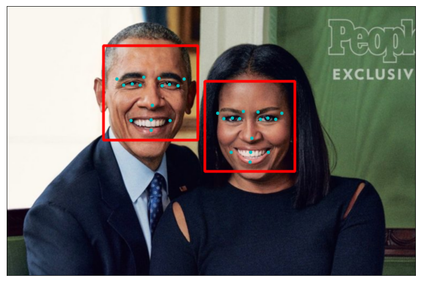
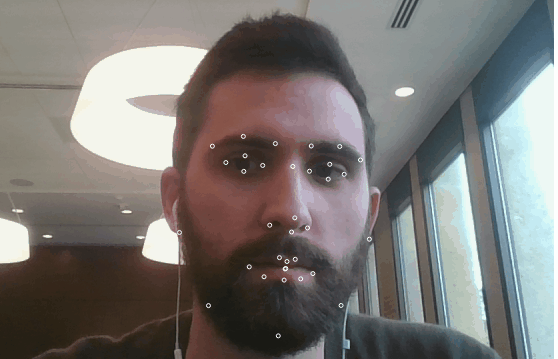

# Facial Keypoint Detection and Real-time Filtering

## Project Overview
In this project we explored OpenCV and face detection applications, then build a Facial Keypoint Detection algorithm and finally add a sunglasses filter automatically on each face. We also adapt our algorithm to function on live video.

**Part 1** : Investigating OpenCV, pre-processing, and face detection

* [Step 0](#step-0): Detect Faces Using a Haar Cascade Classifier
* [Step 1](#step-1): Add Eye Detection
* [Step 2](#step-2): De-noise an Image for Better Face Detection
* [Step 3](#step-3): Blur an Image and Perform Edge Detection
* [Step 4](#step-4): Automatically Hide the Identity of an Individual
* [Step 5](#step-5): Adapt each step to live video from our Webcam

**Part 2** : Training a Convolutional Neural Network (CNN) to detect facial keypoints

* [Step 5](#step-5): Create a CNN to Recognize Facial Keypoints
* [Step 6](#step-6): Compile and Train the Model
* [Step 7](#step-7): Visualize the Loss and Answer Questions

**Part 3** : Putting parts 1 and 2 together to identify facial keypoints on any image!

* [Step 8](#step-7): Build a Robust Facial Keypoints Detector (Complete the CV Pipeline)
* [Step 9](#step-9): Add a sunglasses filter in place of the keypoints
* [Step 10](#step-10): Adapt it to live video from our Webcam.

## Webcam Outputs

