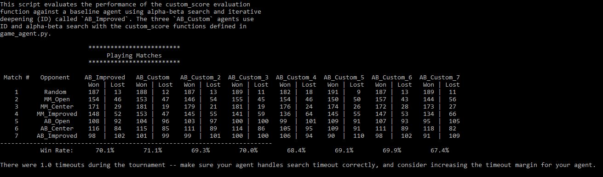
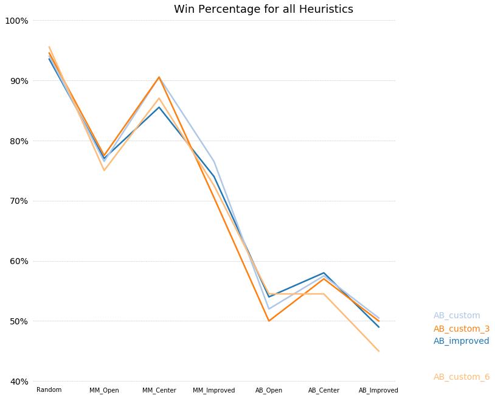

# Build a Game-playing Agent

# Table of Contents
1. [Problem Description](#Problem_Description)
2. [Results Analysis](#Analysis)

## Project Description
The purpose of this project was to develop an adversarial search agent to play the game "Isolation".  Isolation is a deterministic, two-player game of perfect information in which the players alternate turns moving a single piece from one cell to another on a board.  Whenever either player occupies a cell, that cell becomes blocked for the remainder of the game.  The first player with no remaining legal moves loses, and the opponent is declared the winner.  These rules are implemented in the `isolation.Board` class provided in the repository. 

This project uses a version of Isolation where each agent is restricted to L-shaped movements (like a knight in chess) on a 7x7 rectangular grid (like a chess or checkerboard).  The agents can move to any open cell granted that it respect the chess knight movement restrictions.

Additionally, agents will have a fixed time limit each turn to search for the best move and respond.  If the time limit expires during a player's turn, that player forfeits the match, and the opponent wins.

Two search agents were implemented in this projects, **MiniMax** and **Alpha-Beta pruning with iterative deepening**. 

- **MiniMax**: Uses a simple recursive computation. The agent performs a depth-first search all the way down the tree, then the minimax values are back calculated up the tree.
- **Alpha-Beta Pruning**: Prunes tree branches that are identified as failed attempts to minimize computation time.
- **Iterative Deepening**: Keeps a depth-first approach but computes one depth of the tree at a time in order to re-order the moves to allow for more effective pruning with **Alpha-Beta Pruning**.

## Results Analysis

Below is the overall result of 200 games played per match

The different search agents used are listed below:
- **Random**: An agent that randomly chooses a move each turn.
- **MM_Open**: MinimaxPlayer agent using the open_move_score heuristic with search depth 3
- **MM_Center**: MinimaxPlayer agent using the center_score heuristic with search depth 3
- **MM_Improved**: MinimaxPlayer agent using the improved_score heuristic with search depth 3
- **AB_Open**: AlphaBetaPlayer using iterative deepening alpha-beta search and the open_move_score heuristic
- **AB_Center**: AlphaBetaPlayer using iterative deepening alpha-beta search and the center_score heuristic
- **AB_Improved**: AlphaBetaPlayer using iterative deepening alpha-beta search and the improved_score heuristic
- **AB_Custom_#**: AlphaBetaPlayer using iterative deepening alpha-beta search and custom heuristic #.

The different heuristics used are:
- **open_move_score**: A heuristic that maximizes the number of open moves for the current player
- **center_score**: A heuristic that prioratizes moves away from the center of the board
- **improved_score**: A heuristic that maximizes the number of open moves for the player while minimizing the number of opponents open moves.
- **Custom_#**: A series of custom heuristics described below.

### Improved Score Heuristic

The heuristic used as a basis of comparison for the custom heuristics

#### Results:
|             | AB_Improved Win Ratio (%): | AB_Improved Wins/Losses: |
| ----------: | -------------------------: | -----------------------: |
| Random      | 93.5                       | (187, 13)                |
| MM_Open     | 77.0                       | (154, 46)                |
| MM_Center   | 85.5                       | (171, 29)                |
| MM_Improved | 74.0                       | (148, 52)                |
| AB_Open     | 54.0                       | (108, 92)                |
| AB_Center   | 58.0                       | (116, 84)                |
| AB_Improved | 49.0                       | (98, 102)                |

Total Win Ratio (%): 70.14

### Heuristic 1: Difference between each players move, decaying aggressivity, prioratizing center position

This heuristic prioratizes moves that leads to higher number of player moves with lower number of opponents moves. It starts with a higher aggressive focus on opponents moves that decays as the board fills up. It also prioratizes moves closer to the center.

#### The heuristic formula:

dist = distance between player move and center from 0 being center to 1 being a corner

decay = # of current blank spaces / # number of total blank spaces

(# of player moves - # of opponents moves \* 2 \* decay) * 1/dist

#### Results:
|             | AB_Custom_1 Win Ratio (%): | AB_Custom_1 Wins/Losses: |
| ----------: | -------------------------: | -----------------------: |
| Random      | 94.0                       | (188, 12)                |
| MM_Open     | 76.5                       | (153, 47)                |
| MM_Center   | 90.5                       | (181, 19)                |
| MM_Improved | 76.5                       | (153, 47)                |
| AB_Open     | 52.0                       | (104, 96)                |
| AB_Center   | 57.5                       | (115, 85)                |
| AB_Improved | 50.5                       | (101, 99)                |

Total Win Ratio (%): 71.07

### Heuristic 2: Difference between each players move with an aggressive approach

This heuristic prioratizes moves that leads to higher number of player moves with lower number of opponents moves while putting more value on lower number of opponents moves.

#### The heuristic formula:

\# of player moves - # of opponents moves \* 2

#### Results:
|             | AB_Custom_2 Win Ratio (%): | AB_Custom_2 Wins/Losses: |
| ----------: | -------------------------: | -----------------------: |
| Random      | 93.5                       | (187, 13)                |
| MM_Open     | 73.0                       | (146, 54)                |
| MM_Center   | 89.5                       | (179, 21)                |
| MM_Improved | 72.5                       | (145, 55)                |
| AB_Open     | 51.5                       | (103, 97)                |
| AB_Center   | 55.5                       | (111, 89)                |
| AB_Improved | 49.5                       | (99, 101)                |

Total Win Ratio (%): 69.29

### Heuristic 3: Difference between each players move

This heuristic prioratizes moves that leads to higher number of player moves with lower number of opponents moves. 

#### The heuristic formula:

\# of player moves - # of opponents moves

#### Results:
|             | AB_Custom_3 Win Ratio (%): | AB_Custom_3 Wins/Losses: |
| ----------: | -------------------------: | -----------------------: |
| Random      | 94.5                       | (189, 11)                |
| MM_Open     | 77.5                       | (155, 45)                |
| MM_Center   | 90.5                       | (181, 19)                |
| MM_Improved | 70.5                       | (141, 59)                |
| AB_Open     | 50.0                       | (100, 100)               |
| AB_Center   | 57.0                       | (114, 86)                |
| AB_Improved | 50.0                       | (100, 100)               |

Total Win Ratio (%): 70.0

### Heuristic 6: Difference between each players move, decaying aggressivity, prioratizing outer position

This heuristic is the same as heuristic 1 except that it prioratizes position further from the center. 

#### The heuristic formula:

dist = distance between player move and center from 0 being center to 1 being a corner

decay = # of current blank spaces / # number of total blank spaces

(# of player moves - # of opponents moves \* 2 \* decay) * dist

#### Results:
|             | AB_Custom_6 Win Ratio (%): | AB_Custom_6 Wins/Losses: |
| ----------: | -------------------------: | -----------------------: |
| Random      | 93.5                       | (187, 13)                |
| MM_Open     | 78.5                       | (157, 43)                |
| MM_Center   | 86.0                       | (172, 28)                |
| MM_Improved | 73.5                       | (147, 53)                |
| AB_Open     | 53.5                       | (107, 93)                |
| AB_Center   | 55.5                       | (111, 89)                |
| AB_Improved | 49.0                       | (98, 102)                |

Total Win Ratio (%): 69.93

### Heuristic 4,5,7: Different Variance of the distance factor

These heuristics are different variants of heuristic 1 and 6. They also use a distance factor that either values center or outer positions. However, these are applied to either the player or the opponent. I was curious to see whether it would drastically affect the outcome. 

#### The heuristic 4 formula:

dist = distance between player move and center from 0 being center to 1 being a corner

decay = # of current blank spaces / # number of total blank spaces

(# of player moves \* 1/dist - # of opponents moves \* 2 \* decay)

#### The heuristic 5 formula:

dist = distance between player move and center from 0 being center to 1 being a corner

decay = # of current blank spaces / # number of total blank spaces

(# of player moves \* dist - # of opponents moves \* 2 \* decay)

#### The heuristic 7 formula:

dist = distance between player move and center from 0 being center to 1 being a corner

decay = # of current blank spaces / # number of total blank spaces

(# of player moves - # of opponents moves \* 2 \* decay \* 1/dist)

#### Heuristic 4 Results:
|             | AB_custom_4 Win Ratio (%): | AB_custom_4 Wins/Losses: |
| ----------: | -------------------------: | -----------------------: |
| Random      | 91.0                       | (182, 18)                |
| MM_Open     | 77.0                       | (154, 46)                |
| MM_Center   | 88.0                       | (176, 24)                |
| MM_Improved | 68.0                       | (136, 64)                |
| AB_Open     | 49.5                       | (99, 101)                |
| AB_Center   | 52.5                       | (105, 95)                |
| AB_Improved | 53.0                       | (106, 94)                |

Total Win Ratio (%): 68.43

#### Heuristic 5 Results:
|             | AB_custom_5 Win Ratio (%): | AB_custom_5 Wins/Losses: |
| ----------: | -------------------------: | -----------------------: |
| Random      | 95.5                       | (191, 9)                 |
| MM_Open     | 75.0                       | (150, 50)                |
| MM_Center   | 87.0                       | (174, 26)                |
| MM_Improved | 72.5                       | (145, 55)                |
| AB_Open     | 54.5                       | (109, 91)                |
| AB_Center   | 54.5                       | (109, 91)                |
| AB_Improved | 45.0                       | (90, 110)                |

Total Win Ratio (%): 69.14

#### Heuristic 7 Results:
|             | AB_custom_7 Win Ratio (%): | AB_custom_7 Wins/Losses: |
| ----------: | -------------------------: | -----------------------: |
| Random      | 94.5                       | (189, 11)                |
| MM_Open     | 72.0                       | (144, 56)                |
| MM_Center   | 86.5                       | (173, 27)                |
| MM_Improved | 67.0                       | (134, 66)                |
| AB_Open     | 47.5                       | (95, 105)                |
| AB_Center   | 59.0                       | (118, 82)                |
| AB_Improved | 45.5                       | (91, 109)                |

Total Win Ratio (%): 67.43

## Conclusion:

Overall the results are fairly close to each other. A variant of Heuristic 3 (difference between number of moves) seem to be preferable. A decaying aggressivity by having the number of opponent moves being more valuable at the beginning and less valuable towards the end seem to also help. However, a distance factor, as currently implemented doesn't improve the results significantly. 

The graph below show the results of the three best heuristics and shows that the results are very close and it is hard to tell which is better.

| Analyzed Heuristics Agents | Total Win Ratio (%) |
| -------------------------: | ------------------: |
| AB_custom_1                | 71.07               |
| AB_custom_2                | 69.29               |
| AB_custom_3                | 70.0                |
| AB_custom_4                | 68.43               |
| AB_custom_5                | 69.14               |
| AB_custom_6                | 69.93               |
| AB_custom_7                | 67.43               |
| AB_Improved                | 70.14               |

