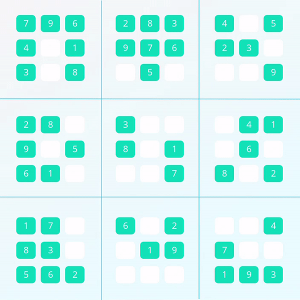
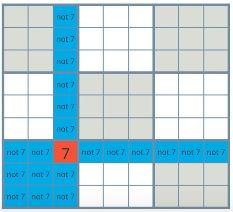
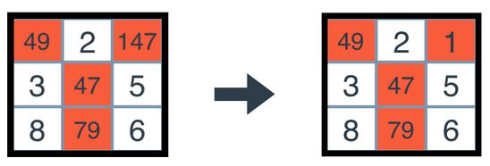
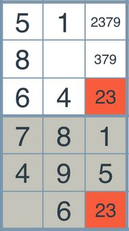
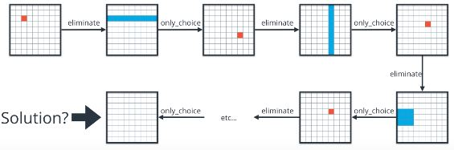
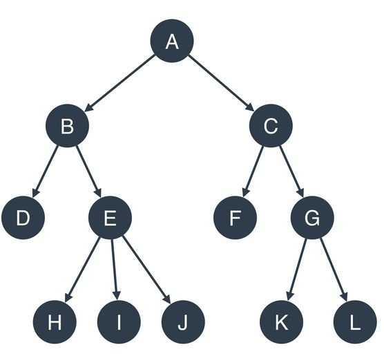

# Sudoku Game Playing Agent

**Sudoku** consists of a 9x9 grid, and the objective is to fill the grid with digits in such a way that each row, each column, and each of the 9 principal 3x3 subsquares (units) contains all of the digits from 1 to 9. 

The main goal of this project is to build an intelligent agent that will solve every sudoku puzzles. The project introduces two key concepts, **constraint propagation** and **search**.

- **Constraint Propagation**: Constraints that help narrow the possibilities for each choice, in other words, reduce the search space. The three constraints used in this project are `eliminate`, `only_choice`, `naked_twins`, and `reduce_puzzle`.
    - `eliminate`: Picks a value for a box and removes that value from all its peers (column, row, unit).

        *Image from Artificial Intelligence Nanodegree at Udacity:*

        

    - `only_choice`: Assigns a value to a box if that value can only appear in that box within a unit.

        *Image from Artificial Intelligence Nanodegree at Udacity:*

        

    - `naked_twins`: if a pair of values are see in two different boxes from a set of peers, they are removed from said peers. Even if it isn't able to determine which of the two value is assigned in which of the two boxes. The elimination of both of these values from the peers reduces the search space.

        *Image from Artificial Intelligence Nanodegree at Udacity:*

        

    - `reduce_puzzle`: applies `eliminate`, `only_choice`, and `naked_twins` alternatively to apply **constraint propagation** to the problem.

        *Image from Artificial Intelligence Nanodegree at Udacity:*

        

- **Search**: creates a tree of possible paths to possible outcomes (solution or unsolvable state). The agent picks a box and assigns it a valid value then tries to solve the puzzle (depth-first search). If the choice doesn't lead to a solution, the agent backtracks to that previous critical choice.

    An example of a tree from *Artificial Intelligence Nanodegree at Udacity*:

    

